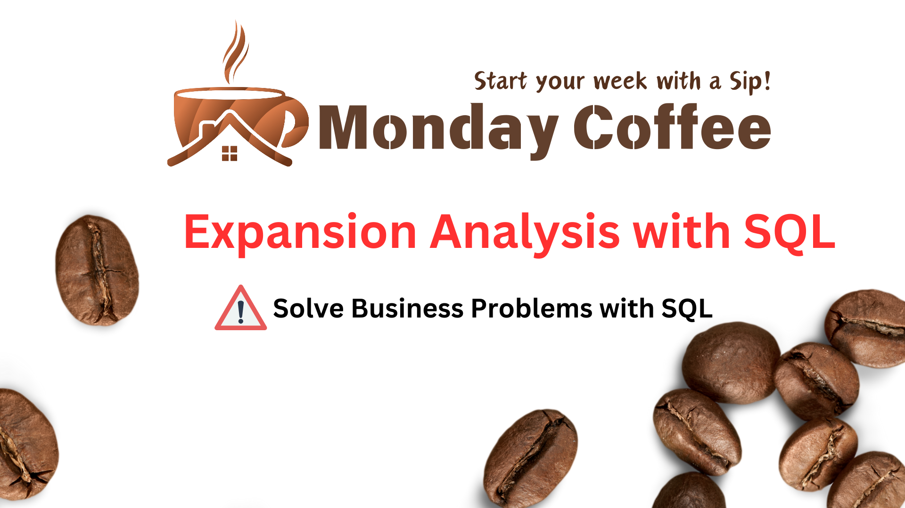

# ☕ MondayCoffee – Coffee Shop Data Analysis



## 📌 About the Project

**MondayCoffee** is a data analysis project focused on understanding the performance of a coffee shop across different cities, areas, and locations.

The project uses **SQL** to analyze sales, customers, products, and location data to identify important business insights and determine which locations are performing the best.

The main goal is to use data to answer real-world business questions and support better decision-making.

---

## 🎯 Project Objectives

The key objectives of this project are:

- 📊 Analyze coffee shop sales performance
- 📍 Compare performance across different cities and locations
- 👥 Understand customer-related insights
- ☕ Analyze product performance
- 💰 Identify high-performing locations
- 📈 Find useful business trends from the data
- 💡 Generate data-driven recommendations

---

## 🗂️ Dataset

The project contains the following datasets:

| File | Description |
|------|-------------|
| `customers.csv` | Customer information |
| `products.csv` | Product details |
| `sales.csv` | Sales transaction data |
| `city.csv` | City and location information |

---

## 🛠️ Technologies Used

- **SQL** – Data analysis and querying
- **CSV** – Dataset storage
- **MySQL / SQL Database** – Database management
- **GitHub** – Project documentation and version control

---

## 📁 Project Structure

```text
MondayCoffee/
│
├── customers.csv
├── products.csv
├── sales.csv
├── city.csv
│
├── Schemas.sql
├── Solutions.sql
│
├── 1.png
├── 2.png
├── 3.png
├── 4.png
├── 5.png
└── 6.png
